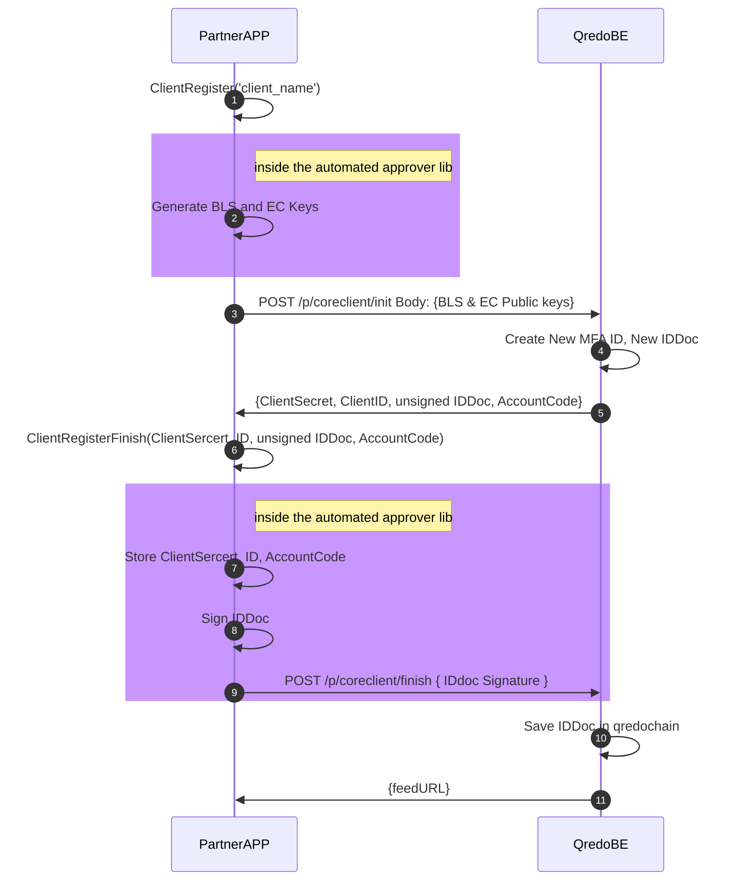
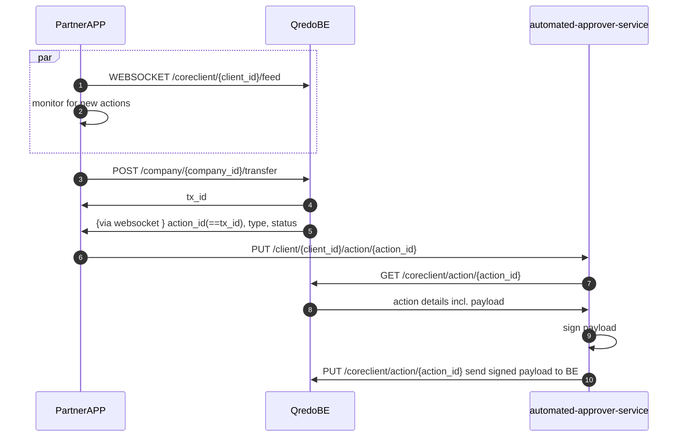

# Introduction

The Automated Approver is an approver agent, that can operate as a standalone service (exposing a RESTful API to 3rd party applications), or as a library integrated into an application. The service must run on premise, hosted on the customer’s infrastructure. Every automated approver instance can be used to generate and manage multiple unique IDs (keys) — e.g. Banco Hipotecario can use the automated approver to create custody signers for each of their clients. The automated approver uses a dedicated subset of the Qredo Server APIs to perform its functions. It uses each client ID to connect to a websocket feed that listens for transactions pending approvals. Also, you it can be used to create a programmable approver bot that uses a automated approver instance to perform automated custody. For this, the Automated Approver must be appointed as an approver of a wallet (or fund).

In a nutshell, it works just like the phone app but without the human element. The automated approver acts just like a human approver, which means they *approve* or *reject* all transaction types that move assets to and from a Qredo wallet:

- **transfer** - (also transfer out) a transaction between wallets that both reside on the Qredo Network: a L2 to L2 transaction.
- **withdrawal** - a transaction where assets in a Qredo wallet move to a wallet outside the Qredo Network (BTC, ETH, etc.): a L2 to L1 transaction).
- **atomic swap** - a transfer out transaction where you offer a certain amount of an asset in exchange for a (transfer in) certain amount of another asset. (e.g. exchange 100000000 ETH qweis for 735601 satoshis). Both parties that participate have a transfer out transaction that undergoes custody with their approvers. This transaction type is discussed in more detail in the [Atomic swaps](https://developers.qredo.com/partner-api/how-tos/atomic-swap/) section of the Qredo documentation portal.

# Using Automated Approver as a Service

As mentioned above, the Automated Approver is a standalone component of the Qredo ecosystem. Everyone who intends to run a Automated Approver must first register it on the Qredo network. Below is a step-by-step explanation of the registration process, which involves a *PartnerAPP* (e.g. Banco Hipotecario), the *automated-approver-service* (e.g. Automated Approver running on Banco Hipotecario’s infrastructure), and *QredoBE* (e.g. our Qredo back-end that we host).

**Question** (from Leszek): We are not pointing here auth headers (diagram below). We do not do it consciously?

```mermaid
sequenceDiagram
  autonumber
  PartnerAPP->>automated-approver-service:POST /client {"name":"..."}
  automated-approver-service->>automated-approver-service: Generate BLS and EC Keys
  automated-approver-service->>PartnerAPP: {BLSPublic, ECPublic, RefID}
  PartnerAPP->>QredoBE: POST /p/coreclient/init Body: {BLS & EC Public keys}
  QredoBE->>QredoBE: Create New MFA ID, New IDDoc
  QredoBE->>PartnerAPP:{ClientSecret, ClientID, unsigned IDDoc, AccountCode}
  PartnerAPP->>automated-approver-service: PUT /client/{RefID} {ClientSercert, ID, unsigned IDDoc, AccountCode}
  automated-approver-service->>automated-approver-service: Store ClientSercert, ID, AccountCode
  automated-approver-service->>automated-approver-service: Sign IDDoc
  automated-approver-service->>QredoBE: POST /p/coreclient/finish { IDdoc Signature }
  QredoBE->>QredoBE: Save IDDoc in qredochain
  QredoBE->>automated-approver-service: {feedURL} 
  automated-approver-service->>PartnerAPP: {feedURL}
 ```

1. The *PartnerApp* triggers the registration process by providing its client name to the *automated-approver-service*.
2. *automated-approver-service* generates BLS and EC keys. 
3. *automated-approver-service* responds to the *PartnerApp* with the corresponding `BLS` and `EC` public keys, as well as a unique identifier called `RefID`.
4. The *PartnerApp* can now register the Automated Approver to the partner API on the *QredoBE*, by sending the `client name`, `BLS`, and `EC` public keys.
5. The *QredoBE* creates the Multifactor Authentication ID called `MFA ID`, and the new `IDDoc` for the Automated Approver (unique identity in the Qredo blockchain).
6. The *QredoBE* responds with ClientSecret, ClientID, unsigned IDDoc, and AccountCode (these need to be defined individually).+
7. The *PartnerApp* sends these new data it received from the *QredoBE* to the *automated-approver-service.*
8. The *automated-approver-service* stores the registration data.
9. It also signes the `IDDoc`.
10. The *automated-approver-service* publishes the `IDDoc` signature to the *QredoBE*.
11. The `IDDoc` is saved in the Qredochain.
12. A `feedURL` is returned by the *QredoBE* to the *automated-approver-service*. This feed is used by the *automated-approver-service* to keep a communication channel open with the *QredoBE*.
13. The `feedURL` is passed along to the *PartnerApp* so that the latter can monitor for new actions that need to be approved with a call to the automated-approver-service.

Notes:

- **BLS** key is used for signing actions (transactions)
- **EC** key is used for the authentication of the automated-approver-service to the Qredo BE.
- **ClientSecret** and **ClientID** are sensitive data and currently stored by the automated-approver-service in a json file, thus requiring the service to be run in a secure environment.
- **IDDoc** is a document describing the automated-approver in the Qredo blockchain. It is returned from the BE to the PartnerAPP and is to be signed by the automated-approver in the final step.
- **AccountCode** is a unique identifier derived from the **IDDoc** and is used to identify the client in the Qredo blockchain.

All the data above is currently stored on premises in a file by the automated-approver-service, and since some of it (ClientSecret, EC & BLS private keys) is quite sensitive it needs to be running in a secure environment.

**Note:** an always up to date API documentation can be accessed within the (private) [Gitlab repo](https://gitlab.qredo.com/custody-engine/automated-approver/-/blob/master/doc/swagger/swagger.yaml).

## API

### POST /client

Request:

```json
{
  "name": "string"
}
```

Response (clientRegisterResponse):

```json
{
  "bls_public_key": "string",
  "ec_public_key": "string",
  "ref_id": "string"
}
```

### POST /client/{ref}

Request:

```json
{
  "accountCode": "string",
  "clientID": "string",
  "clientSecret": "string",
  "id": "string",
  "idDoc": "string"
}
```

Response (clientRegisterFinishResponse):

```json
{
  "feed_url": "string"
}
```

### POST /client/{client_id}/sign

Request:

```json
{
  "message_hash_hex": "string"
}
```

Response (signResponse):

```json
{
  "signature_hex": "string",
  "signer_id": "string"
}
```

### POST /verify

Request:

```json
{
  "message_hash_hex": "string",
  "signature_hex": "string",
  "signer_id": "string"
}
```

### Data Models

```Go
ClientRegisterFinishRequest {
    accountCode    string
    clientID   string
    clientSecret   string
    id  string
    idDoc  string
}
```

```Go
ClientRegisterRequest {
    name    string
}
```

```Go
SignRequest {
    message_hash_hex    string
}
```

```Go
VerifyRequest {
    message_hash_hex    string
    signature_hex   string
    signer_id   string
}
```

```Go
clientRegisterFinishResponse {
    feed_url    string
}
```

```Go
clientRegisterResponse {
    bls_public_key  string
    ec_public_key   string
    ref_id  string
}
```

```Go
signResponse {
    signature_hex   string
    signer_id   string
}
```

# Using Automated Approver as a Library

There are times when the Automated Approver benefits from being tightly coupled with an application or a service. In this case, it can be imported as a Go package directly into that application.

 An example of the automated approver onboarding process using the automated approver library in a Go app would look like:



# Approving a transaction

Prerequisites: 

- a automated approver service instance has been installed and configured
- a automated-approver has been created with id `client_id`

Steps:

1. A websocket connection to the *Qredo BE* is opened for said `client_id`
2. *PartnerAPP* is constantly monitoring for new actions to be handled
3. A new transfer is initiated
4. The *Qredo BE* returns the transaction id: `tx_id`
5. Shortly after, a new action is received through the websocket with `action_id` equal to the `tx_id` for the transfer.
6. Initiate new action
7. The *PartnerAPP* requests from the *Qredo BE* details for the action
8. *Qredo BE* returns action details incl. the payload
9. Sign payload (for the new action)
10. The *PartnerAPP* decides to approve the transactions, thus sending the payload to the automated-approver with a `PUT` request. (`DELETE` is for reject)

After that sequence, the transaction should be complete.

### Using the service



### Using the library

```mermaid
sequenceDiagram
  autonumber

  par
  PartnerAPP->>QredoBE: WEBSOCKET /coreclient/{client_id}/feed
  PartnerAPP->>PartnerAPP: monitor for new actions
  end
  PartnerAPP->>QredoBE:POST /company/{company_id}/transfer
  QredoBE->>PartnerAPP: tx_id
  QredoBE->>PartnerAPP: {via websocket } action_id(==tx_id), type, status
  PartnerAPP->>PartnerAPP: ActionApprove(agentID, actionID)
  rect rgb(200, 150, 255)
  note right of PartnerAPP: inside the automated approver lib
  PartnerAPP->>QredoBE: GET /coreclient/action/{action_id}
  QredoBE->>PartnerAPP: action details incl. payload
  PartnerAPP->>PartnerAPP: sign payload
  PartnerAPP->>QredoBE: PUT /coreclient/action/{action_id} send signed payload to BE
  end
