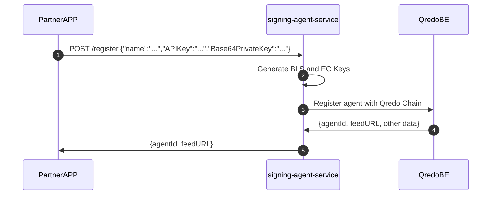
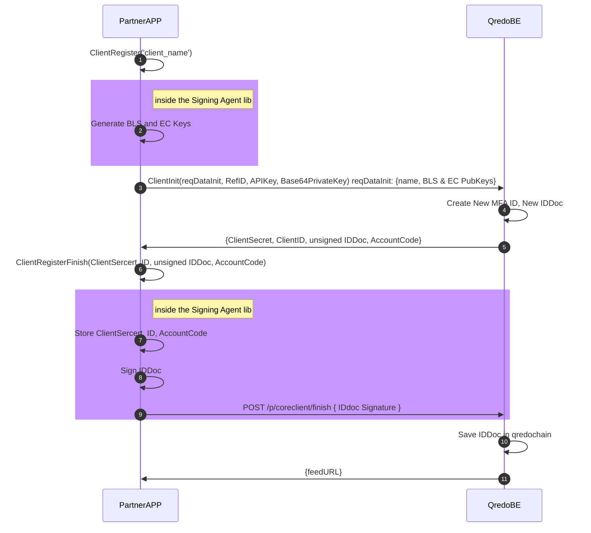
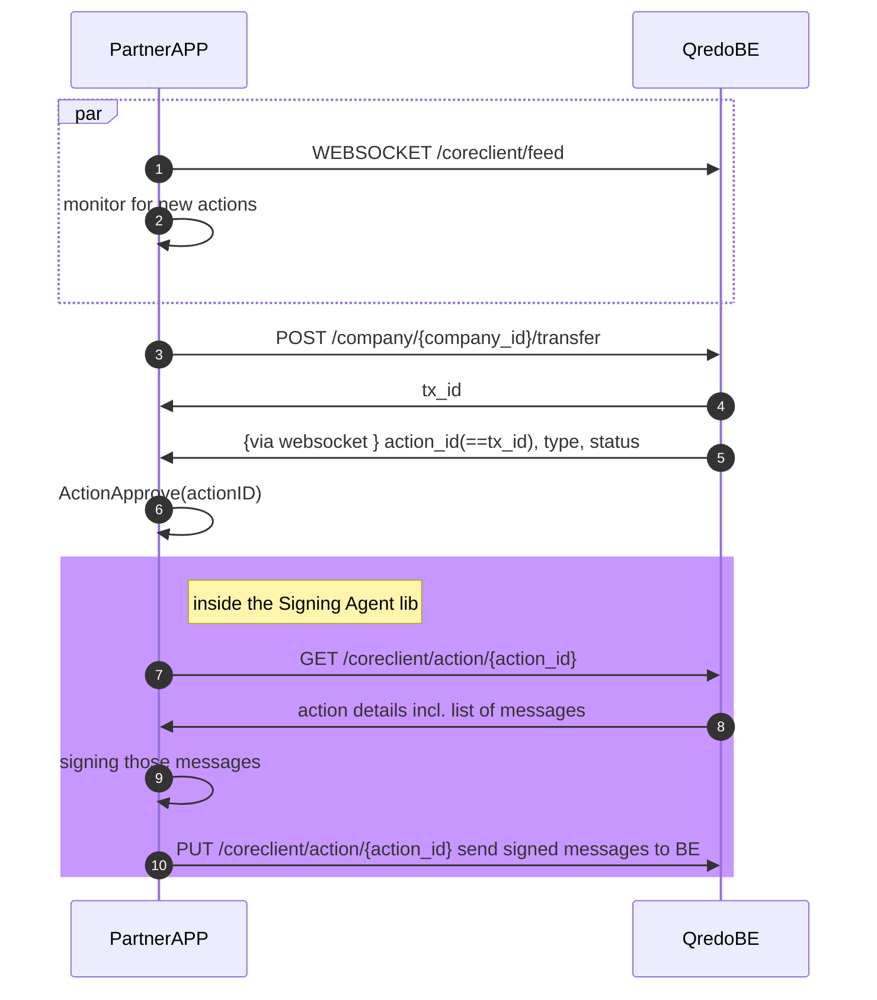

[TOC]

# Introduction

The Signing Agent is an agent that can operate as a standalone service (exposing a RESTful API to 3rd party applications), or as a library integrated into an application. We recommend deploying the service on premise, on the customer’s infrastructure. We also recommend that every Signing Agent instance be used to manage a unique agent ID, and that multiple instances be deployed (preferably on different cloud infrastructures) in order to meet a multiple signer threshold such as 2 or 3 out of 5. The Signing Agent uses a dedicated subset of the Qredo Server APIs, called the Partner API, to perform its functions. It can also be used to create a programmable approver service that listens to incoming approval requests over Websockets, and is then able to perform automated custody.

In a nutshell, it works just like the phone app but without the human element. The server acts just like a human approver, which means that it *approves* all transaction types that move assets to and from a Qredo wallet:

- **transfer** - (also transfer out) a transaction between wallets that both reside on the Qredo Network: a L2 to L2 transaction.
- **withdrawal** - a transaction where assets in a Qredo wallet move to a wallet outside the Qredo Network (BTC, ETH, etc.): a L2 to L1 transaction).
- **atomic swap** - a transfer out transaction where you offer a certain amount of an asset in exchange for a (transfer in) certain amount of another asset. (e.g. exchange 100000000 ETH qweis for 735601 satoshis). Both parties that participate have a transfer out transaction that undergoes custody with their approvers. This transaction type is discussed in more detail in the [Atomic swaps](https://developers.qredo.com/partner-api/how-tos/atomic-swap/) section of the Qredo documentation portal.

# Using Signing Agent as a Service

As mentioned above, the Signing Agent is a standalone component of the Qredo ecosystem. Everyone who intends to run an Signing Agent must first register it on the Qredo network. Below is a step-by-step explanation of the registration process, which involves the *PartnerAPP* (e.g. Banco Hipotecario), the *signing-agent-service* (e.g. Signing Agent running on Banco Hipotecario’s infrastructure), and *QredoBE* (e.g. our Qredo back-end).



1. The *PartnerApp* triggers the registration process by providing its client name, parther APIKey and Base64PrivateKey  to the *signing-agent-service*.
2. *signing-agent-service* generates BLS and EC keys. 
3. The *signing-agent-service* can now register itself to the partner API on the *QredoBE*, by sending the `client name`, `BLS`, and `EC` public keys. The *QredoBE* is returning ClientID, CLientSecret that will be responsible for authentication.
4. The `agentId` and a `feedURL` is returned by the *QredoBE* to the *signing-agent-service*. This feed is used by the *signing-agent-service* to keep a communication channel open with the *QredoBE*.
5. The `agentId` and a `feedURL` is also passed along to the *PartnerApp* so that the latter can monitor for new actions that need to be approved in case the service is not configured for auto-approval.

All the data above is currently stored on premises in a file by the signing-agent-service, and since some of it (ClientSecret, EC & BLS private keys) is quite sensitive it needs to be running in a secure environment.

**Note:** an always up to date API documentation can be accessed within the (private) [Gitlab repo](https://gitlab.qredo.com/custody-engine/signing-agent/-/blob/master/doc/swagger/swagger.yaml).

## API

### POST /api/v1/register

Request:

```json
{
  "name": "string", 
  "APIKey": "string",
  "Base64PrivateKey": "string"
}
```

Response (clientRegisterResponse):

```json
{
  "agentId": "string",
  "feedUrl": "string"
}
```


# Using Signing Agent as a Library

There are times when the Signing Agent benefits from being tightly coupled with an application or a service. In this case, it can be imported as a Go package directly into that application.

 An example of the Signing Agent onboarding process using the Signing Agent library in a Go app would look like:



# Approving a transaction

Prerequisites: 

- a Signing Agent service instance has been installed and configured
- a signing-agent has been created with id `agentID`

Steps:

1. A websocket connection to the *Qredo BE* is opened for said `agentID`
2. *PartnerAPP* is constantly monitoring for new actions to be handled
3. A new transfer is initiated
4. The *Qredo BE* returns the transaction id: `tx_id`
5. Shortly after, a new action is received through the websocket with `action_id` equal to the `tx_id` for the transfer.
6. Initiate new action
7. The *PartnerAPP* requests from the *Qredo BE* details for the action
8. *Qredo BE* returns action details incl. the payload (list of messages)
9. Sign payload (for the new action)
10. The *PartnerAPP* decides to approve the transactions, thus sending the payload to the signing-agent with a `PUT` request. (`DELETE` is for reject)

After that sequence, the transaction should be complete.

### Using the library to approve a transaction




### Data Models

```Go
ClientRegisterFinishRequest {
    accountCode    string
    clientID   string
    clientSecret   string
    id  string
    idDoc  string
}
```

```Go
ClientRegisterRequest {
    name             string
    apikey           string
    base64privatekey string
}
```

```Go
SignRequest {
    message_hash_hex    string
}
```

```Go
VerifyRequest {
    message_hash_hex    string
    signature_hex   string
    signer_id   string
}
```

```Go
clientRegisterFinishResponse {
    feed_url    string
}
```

```Go
clientRegisterResponse {
    bls_public_key  string
    ec_public_key   string
    ref_id  string
}
```

```Go
signResponse {
    signature_hex   string
    signer_id   string
}
```

<br/>

### Oracle Cloud Vault Storage

<br/>

config:
```yaml
base:
  ...
  store_type: oci
  store_oci:
    vault: ocid1.vault....
    secret_encryption_key: ocid1.key....
    compartment: ocid1.tenancy....
    config_secret: automated_approver_config
  ...
```

- Setup an API key on Oracle Cloud
- Download the config file for the api key, fill in the correct private key path
- Either put the file in its default location of ~/.oci/config or 
  put it in a custom location and set env var OCI_CONFIG_FILE to the full path including the filename
- Create a vault and copy the OCID to the config file for the vault setting
- Create an encryption key (AES or RSA) in the vault, copy it's OCID to the config secret_encryption_key setting
- Copy the compartment OCID from the compartment where the vault was created
- Set a secret name where the signing agent will store its configuration and keys
- Start the signing agent and register an agent using the API
