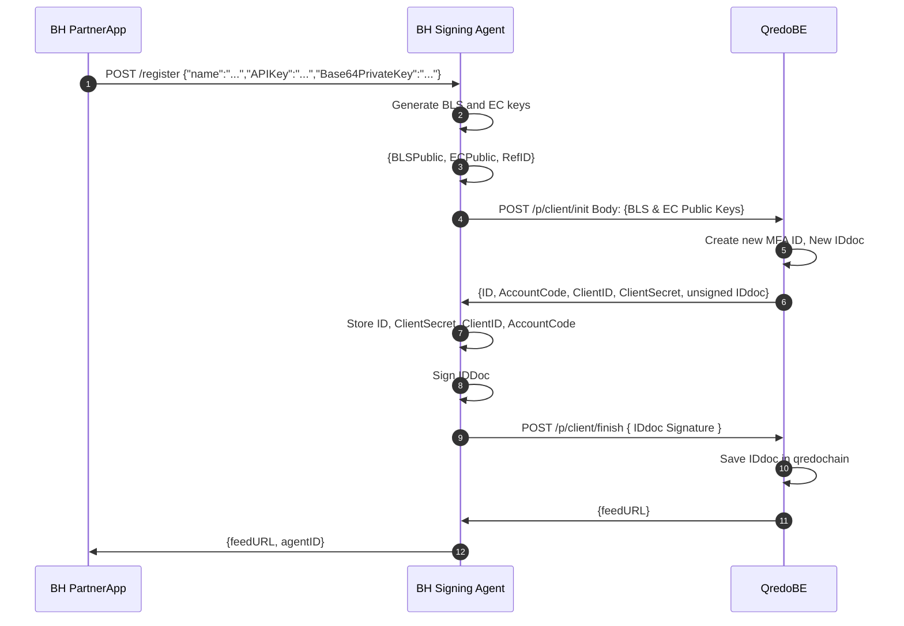

# Registration process (step-by-step explanation)

Below is a step-by-step explanation of the registration process, which involves the *PartnerApp* (e.g. Banco Hipotecario Partner Application), the *signing-agent-service* (e.g. Signing Agent running on Banco Hipotecario’s infrastructure), and *QredoBE* (e.g. our Qredo back-end).

1. The *PartnerApp* triggers the registration process by providing its client name, parther APIKey and Base64PrivateKey  to the *signing-agent-service*.
2. *signing-agent-service* generates BLS and EC keys.
3. *signing-agent-service* storage BLS and EC keys.
4. The *signing-agent-service* can now register itself to the partner API on the *QredoBE*, by sending the `client name`, `BLS`, and `EC` public keys.
11. The `agentId` and a `feedURL` is returned by the *QredoBE* to the *signing-agent-service*. This feed is used by the *signing-agent-service* to keep a communication channel open with the *QredoBE*.
12. The `agentId` and a `feedURL` is also passed along to the *PartnerApp* so that the latter can monitor for new actions that need to be approved in case the service is not configured for auto-approval.
