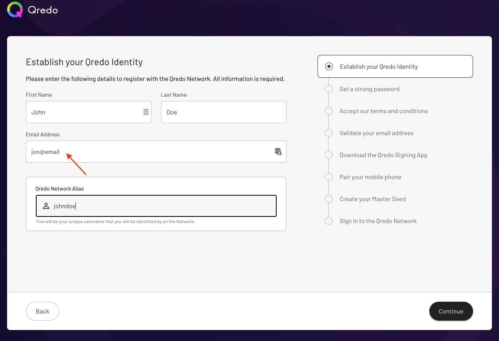
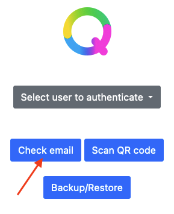
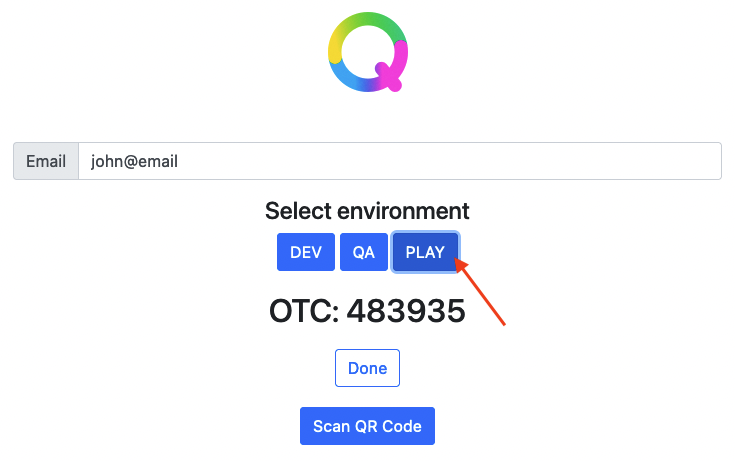
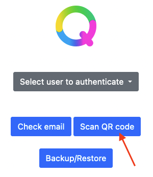
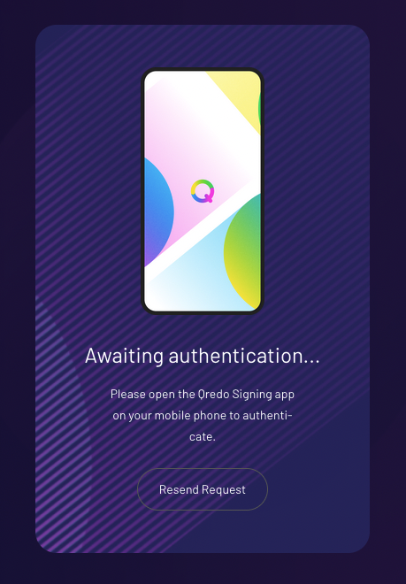
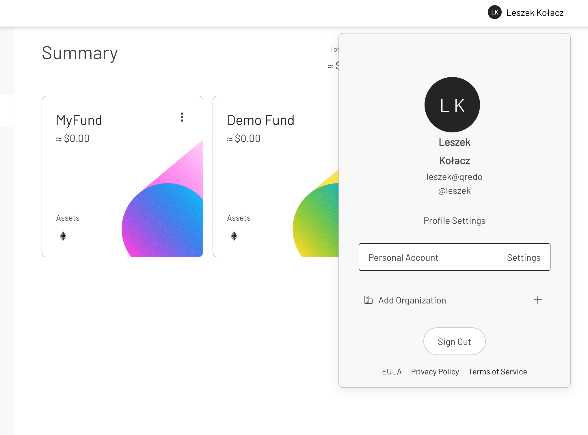

# Doc for Partners

This guide is meant to walk you through all the steps necessary to integrate a 3rd party App (which from now on we’ll refer to as the **PartnerApp**) with the Signing Agent and our Partner API.

# Creating a Qredo account to obtain the API key

If you haven’t done so, please follow the following guide to first create an account on the Play environment, so you can test the Signing Agent in our sandbox environment before using it in production.

## Creating an account on the Play environment

The first step is to visit the Play environment app at [https://play.qredo.network/](https://play.qredo.network/). This is a special purpose sandbox environment that you can use for testing, without fear of breaking anything.


Once on that page, click the “Join Qredo” button at the bottom and you’ll be taken to the signup page. If you want to avoid having to install the phone app, you can use an email address in the format `user@domain` without a TLD (e.g. .com or .net).



Next, click Continue to go through the other steps until you reach “Validate your email address”. To obtain the validation code, you need to use the mock email service provided by the [Qredo Mobile Demo app](https://mobile.qredo.net/#). Open the app in your browser and click on the “Check email” button.



Next, type the same email address you used before (e.g. `user@domain`) in the registration form, and then click on PLAY (which means the play environment we’re using for the account).



Then please copy the OTC code to the registration form and click Continue. Next, just click on Continue again to skip the “Download the Qredo Signing App” step so you’ll arrive at “Pair your mobile phone” step.


Next, we’re going to mock the mobile app pairing, again with the help of our [Qredo Mobile Demo app](https://mobile.qredo.net/#) that you used before for email validation. First, with your mobile phone,  take a close-up picture of the QR code displayed in the form.


Go to the [Qredo Mobile Demo app](https://mobile.qredo.net/#) now and click on “Scan QR code”. Allow the browser access to your camera, and point the phone with the picture of the QR code to face your computer camera.



If the QR code works, you’ll be presented with a keypad screen where you can define your 4 digit access PIN. Type in your PIN and click on the green arrow. Remember, this PIN will be required later on when you have to log into the Play environment.


Once you set up your PIN, the registration process will automatically go through the last steps and tell you that it is done.


## Logging into the Play environment

Signing into your account is straightforward. Just type in the email address you registered with, as well as the password, and click on “Sign In”.


You will see a screen asking you to authenticate with your mobile app. In our case, we’re going to mock it again by using our [Qredo Mobile Demo app](https://mobile.qredo.net/#).



Click on the “Select user to authenticate” dropdown and select your user from the list. You’ll have to type in your PIN and click the green arrow to proceed. Then go back to the other tab/window with your Play environment and you’ll be logged in.


## Obtaining the API key

Before continuing with the guide, it is recommended you enable Testnet Assets. To do that, click your name in the top right corner and select “Profile Settings” from the popup.



Next, select **Personal Account** and then the **Preferences** tab and enable **Testnet Assets** to use ETH-GOERLI and BTC-TESTNET.


Next you have to set up the Play sandbox to generate API keys for the Partner API and the Signing Agent
- Click **API** tab (top right), select **Partner API** and **Generate API Key** for the production or sandbox environments, or regenerate them if needed. Once you have generated the API key, please also copy it into an empty `apiKey` file.
- You will also have to upload the `public.pem` key file that you’ll generate in the next section. You can come back afterwards and upload it.


Now, the Qredo Back End is ready to accept API requests.

# Deploying the Docker image

## Create a Docker volume for storing config data

You need to create a local folder to store the database (and the private RSA key, generated later, if you want - it's not required). When you run the Docker image, you must reference that local folder since it is shared between the local system and the Docker image. For this reason, we need to create the Docker volume service first. Go here to learn more about [Docker volumes](https://docs.docker.com/storage/volumes/).

At this stage, create a folder and later the db will be created there automatically (by docker).
Configure it via `docker create volume`. For example, we will create a local folder and name it `volume`.
In the terminal, run this command to create the folder in your home dir:

`mkdir ~/volume`

In the steps that follow, you will create the `private.pem` files and store it in the Docker volume folder that you’ve just created.

## Config data

Please make sure to copy the `config.yaml` (YAML configuration) file provided with the image to the `volume` directory. Please see the [YAML configuration template](configuration.md) documentation for a description of each configuration option available.


## Generate RSA keys for signing request on register step (Partner API)

The following example uses the terminal (CLI) for generating the RSA key pair, but you can use any preferred tool to perform this task. The Qredo Partner API works with 2048 bit RSA keys.

1. Open a terminal and type the following commands:

2. Generate a 2048 bit RSA Key pair and store the private key in a file named private.pem using the CLI command:

`openssl genrsa -out private.pem 2048`

You should see the following message:

*Generating RSA private key, 2048 bit long modulus...*

3. Extract the public key from the key pair and store it in a file named public.pem using the command:

`openssl rsa -in private.pem -outform PEM -pubout -out public.pem`

Copy your `private.pem` file to the local `volume` folder you created above or keep it in safe place.

4. Generate base64 representation of this `private.pem` key

`base64 /path/to/volume/private.pem`

Copy your `Base64PrivateKey` token to the clipboard. You are going to use it as a part of payload data on registration endpoint.

5. Upload the public.pem to the Partner API sandbox.  Go back to the (web) page where you generated the API key and click
**Add Public Key**.  Copy and paste in the contents of the public.pem generated above.

## Create Docker volume and run the image

**Important!** before running the docker image, please make sure to copy the `config.yaml` (YAML configuration) file provided with the image to the `volume`.

1. Create Docker volume:

`docker volume create --name volume_folder --opt type=none --opt device=/path/to/your/local/volume --opt o=bind`

2. Import the Docker image you obtained from Qredo:

`docker load < /path/to/docker/image.tar`

3. Run the Docker image in the terminal, using the command:

`docker run -p 8007:8007 -v volume_folder:/volume signing-agent:dev`

You can now continue with testing of the Docker image.

# Registering the Signing Agent Service

When everything is set up properly (Qredo account creation is complete and the public key has been locally generated and is stored through the Web interface) you can start using the Signing Agent service. For the following examples, we assume the Signing Agent service is running at `https://agent.example.org/` but that
should be changed to the address and port of the signing service you started above.  (Most likely this will be: `http://localhost:8007`.)

The PartnerApp triggers the registration process by providing an agent name, partner api key and private.pem represented by base64 string to the Signing Agent service. You don't have to remember the `agentID` value, because You can call `GET https://agent.example.org/api/v1/client` endpoint to get it.

```bash
**Request**:

curl -X 'POST' \
  'https://agent.example.org/api/v1/register' \
  -H 'Content-Type: application/json' \
  -H 'X-API-KEY: eyJrZXlfaWQiOFuZGJveCI6dHJ1ZX0=' \
  -d '{"name": "Test Agent", "APIKey": "Partner APIKey from the webpage", "Base64PrivateKey": "token from the clipboard"}'

**Response**:

{
	"agentID":"CBApocs97bS7SgE21Ht5xRHFWRbcrH9AMZHgsoUd2gpp",
	"feedURL":"ws://localhost:8007/api/v1/client/feed"
}
```

Once the Signing Agent registration process is complete, we can now proceed to creating a company through the Partner API, effectively enabling us to then have a fund and wallets.

# Create a company

Note: for this and all subsequent commands, replace the X-API-KEY with the apiKey you generated for the Sandbox PartnerAPI.

To create a company, we need to call the PartnerAPI and to provide some details for the company. Please make sure to store the `company_id` you receive in the response, since you will need it later. More details in the [official documentation for the PartnerAPI](https://developers.qredo.com/partner-api/api-reference/api-reference/#company).

```bash
**Request:**

curl -X 'POST' \
  'https://play-api.qredo.network/api/v1/p/company' \
  -H 'accept: application/json' \
  -H 'X-API-KEY: eyJrZXlfaWQiOFuZGJveCI6dHJ1ZX0=' \
  -H 'Content-Type: application/json' \
  -d '{
  "name": "TestCompany",
  "city": "Paris",
  "country": "FR",
  "domain": "company.com",
  "ref": "a-b-c-d-e"
}'

Response:

{
	"company_id":"2Bfg0fYqMhaSQ1ZvowpH02mDEaH",
	"ref":"a-b-c-d-e"
}
```

# Add the Signing Agent as a Trusted Party

Using the `company_id` from the previous step (replace the red text in the example URL), we can now add the ID of the Signing Agent as a trusted party for the newly created company. This is important, because otherwise there is no way to programatically add the Agent to the fund and wallet policies. **Only trusted parties can be added to security policies.** More details for this request can be found in the [official documentation for the PartnerAPI](https://developers.qredo.com/partner-api/core-client/set-up-core-client/#2-enlist-the-core-client-as-a-trusted-party).

```bash
**Request:**

curl -X 'POST' \
  'https://play-api.qredo.network/api/v1/p/company/{company_id}/trustedparty' \
  -H 'accept: application/json' \
  -H 'X-API-KEY: eyJrZXlfaWQiOFuZGJveCI6dHJ1ZX0=' \
  -H 'Content-Type: application/json' \
  -d '{"address":"CBApocs97bS7SgE21Ht5xRHFWRbcrH9AMZHgsoUd2gpp"}'

**Response:**

{"code":200,"msg":"OK"}
```

# Create a fund with a wallet and corresponding policies

Here we are explicitly creating a new fund, while at the same time defining the **withdraw** and **transaction** policies for it. We are also creating a new *ETH-GOERLI* wallet with its own withdraw and transaction policies. The Play environment also supports *BTC-TESTNET*. The only member we are now adding to all the policies is the Signing Agent (using the `agentID` we received during the registration step). Please make sure to store the `fund_id` you receive in the response, since you will need it later. More details for this particular request can be found in the [official documentation for the PartnerAPI](https://developers.qredo.com/partner-api/api-reference/api-reference/#funds).

```bash
**Request:**

curl -X 'POST' \
  'https://play-api.qredo.network/api/v1/p/company/{company_id}/fund' \
  -H 'accept: application/json' \
  -H 'X-API-KEY: eyJrZXlfaWQiOFuZGJveCI6dHJ1ZX0=' \
  -H 'Content-Type: application/json' \
  -d '{
  "name": "Test Fund",
  "description": "Test Fund with agent policy",
  "custodygroup_withdraw": {
    "threshold": 1,
    "members": [
      "CBApocs97bS7SgE21Ht5xRHFWRbcrH9AMZHgsoUd2gpp"
    ]
  },
  "custodygroup_tx": {
    "threshold": 1,
    "members": [
      "CBApocs97bS7SgE21Ht5xRHFWRbcrH9AMZHgsoUd2gpp"
    ]
  },
  "wallets": [
    {
      "name": "New wallet with custom custody group",
      "asset": "ETH-GOERLI",
      "custodygroup_withdraw": {
        "threshold": 1,
        "members": [
          "CBApocs97bS7SgE21Ht5xRHFWRbcrH9AMZHgsoUd2gpp"
        ]
      },
      "custodygroup_tx": {
        "threshold": 1,
        "members": [
          "CBApocs97bS7SgE21Ht5xRHFWRbcrH9AMZHgsoUd2gpp"
        ]
      }
    }
  ]
}'

**Response**:

{
	"fund_id":"2BfgvL0K8wlDYAZ3GYHsfrVvSFq",
	"custodygroup_withdraw":"2BfgvM8r63hEAeSQlwZdjgGsuOj",
	"custodygroup_tx":"2BfgvKMhdq6Z0dgNDmwq8wTIORg"
}
```

# Discover wallet address and deposit testnet assets to the wallet

Since we have created a fund with an ETH-GOERLI asset type (Ropsten testnet), we can now try to deposit some test ETH. To do that, first we need to find out the ETH address to which we need to send the assets. We’ll ask for the list of fund assets with their deposit addresses and current balances. Each fund contains one or more deposit addresses for the different types of assets. As you can see below, for this request we have supplied the `company_id` and `fund_id` we previously obtained in the API URL.

```bash
**Request**:

curl -X 'GET' \
  'https://play-api.qredo.network/api/v1/p/company/{company_id}/fund/{fund_id}/deposit' \
  -H 'accept: application/json' \
  -H 'X-API-KEY: eyJrZXlfaWQiOFuZGJveCI6dHJ1ZX0='

**Response**:

{
  "total_count": 1,
  "list": [
    {
      "asset": "ETH-GOERLI",
      "address": "0x9B2154307C4987B9e67389cea8795E921b71e117",
      "balance": 0
    }
  ]
}
```

You can now send Ropsten ETH from any account to the above address — i.e. `0x9B2154307C4987B9e67389cea8795E921b71e117`. Performing the same request at a later point in time will show a change in the balance value.

# Whitelist addresses for withdrawal

Before we can withdraw assets, we need to whitelist the external wallet address. More details for this request can be found in the [official documentation for the PartnerAPI](https://developers.qredo.com/partner-api/api-reference/api-reference/#addresses).

```bash
**Request:**

curl -X 'POST' \
  'https://play-api.qredo.network/api/v1/p/company/{company_id}/fund/{fund_id}/whitelist' \
  -H 'X-API-KEY: eyJrZXlfaWQiOFuZGJveCI6dHJ1ZX0=' \
  -H 'Content-Type: application/json' \
  -d '{
  "name": "Metamask",
  "asset": "ETH-GOERLI",
  "address": "0x5F1F7bD49690c...9Be67ED6A2b6F76c86127"
}'

**Response:**

{"code":200,"msg":"OK"}
```

# L1 transaction (withdraw) to external wallet

Here we are requesting a withdrawal of 1000 gwei to an external wallet that we have previously whitelisted. We are providing the `company_id` as well as the `wallet_id` from which we are making the withdrawal. More details for this request can be found in the [official documentation for the PartnerAPI](https://developers.qredo.com/partner-api/api-reference/api-reference/#withdrawals).

```bash
**Request:**

curl -X 'POST' \
  'https://play-api.qredo.network/api/v1/p/company/{company_id}/withdraw' \
  -H 'accept: application/json' \
  -H 'X-API-KEY: eyJrZXlfaWQiOFuZGJveCI6dHJ1ZX0=' \
  -H 'Content-Type: application/json' \
  -d '{
  "wallet_id": "A7muugCr15rn4AuKfG2srXm6SPLNRyrodtoZuuHYhqZc",
  "address": "0x5F1F7bD49690c...9Be67ED6A2b6F76c86127",
  "expires": 1657389752,
  "benefit_of": "John Smith",
  "account_no": "123-XX",
  "reference": "CX15R99XX",
  "partner_txID": "",
  "send": {
    "symbol": "ETH-GOERLI",
    "amount": 1000
  }
}'

**Response**:

{
	"tx_id":"2BfisRs6MiHMbowbmpFdSW8uqVg",
	"status":"new"
}
```

# L2 transaction (transfer) via Signing Agent Service

The L2 transaction (or transfer) is very similar to the withdrawal operation, except that it will incur no fees. The only difference is that a transfer uses `wallet_id` instead of `address` for the counterparty — e.g. `8uefDb78XGtsbzf1SAZWnxGnSbVHwZdndCvZvGtRjTXF`.

```bash
**Request:**

curl -X 'POST' \
  'https://play-api.qredo.network/api/v1/p/company/{company_id}/transfer' \
  -H 'accept: application/json' \
  -H 'X-API-KEY: eyJrZXlfaWQiOFuZGJveCI6dHJ1ZX0=' \
  -H 'Content-Type: application/json' \
  -d '{
  "wallet_id": "A7muugCr15rn4AuKfG2srXm6SPLNRyrodtoZuuHYhqZc",
  "counterparty_wallet_address": "8uefDb78XGtsbzf1SAZWnxGnSbVHwZdndCvZvGtRjTXF",
  "expires": 1657389752,
  "benefit_of": "John Smith",
  "account_no": "123-XXX",
  "reference": "ABC123",
  "partner_txID": "some-partner-txxID",
  "send": {
    "symbol": "ETH-GOERLI",
    "amount": 50000
  }
}'

**Response:**

{
	"tx_id":"2BfnVsCH9khcTCDX27W8fdbMeXV",
	"status":"new"
}
```
