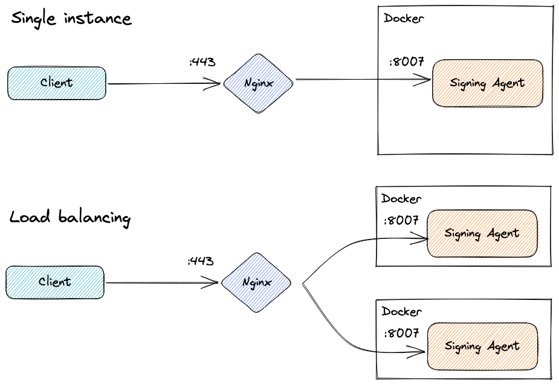
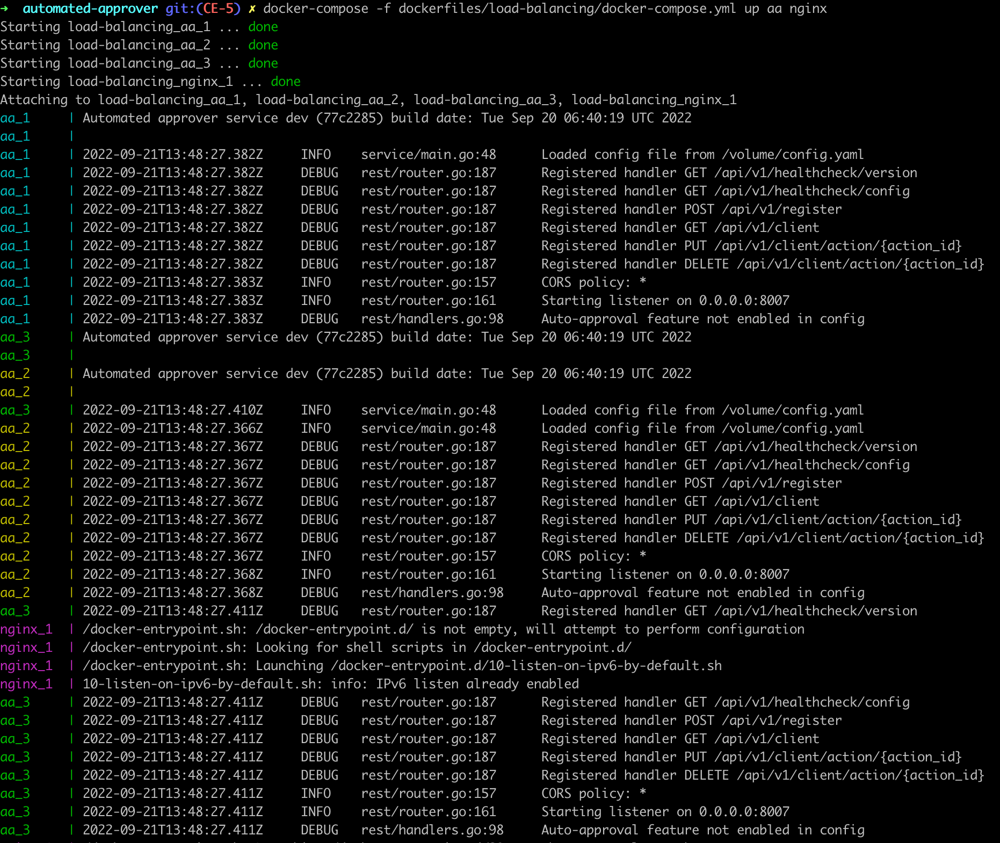

# Load Balancing

You should be able to run more than one container instance of the Signing Agent, and establish NGINX load balancer between available instances. A distributed mutex mechanism (based on Redis) is used to ensure synchronization between individual instances.



### Prerequisites

[Docker installation](getting-started.md#deploy-the-signing-agent), Docker compose and Golang environments must already be installed.

### Compile the project as Docker image

First we need to enter the project directory:
```cd {project_dir}```

Second we need to build a Docker image, this can be done with:
```./build.sh docker```

All necessary files are located in: **{project_dir}/dockerfiles/load-balancing**

### Important variables

The `docker-compose.yml` presents:

- **deploy.replicas**: the number of instances we want to run
- **ports**: the port that accepts the requests

### Start the load balancer

Start the service using the command:

```docker-compose -f {project_dir}/dockerfiles/load-balancing/docker-compose.yml up aa nginx```

This prepares NGINX and signing-agent images.
NGINX uses the **nginx.conf** file to specify and rotate the requests between signing-agent running instances, where **worker_connections** represents the max concurrent connections the load balancer can handle.

### Stop the load balancer

Stop the service using the command:

```docker-compose -f {project_dir}/dockerfiles/load-balancing/docker-compose.yml down --remove-orphans```

Now you can start sending requests to `localhost:9090`.
You can change the *port* by editing **docker-compose.yml** and **nginx.conf**.


