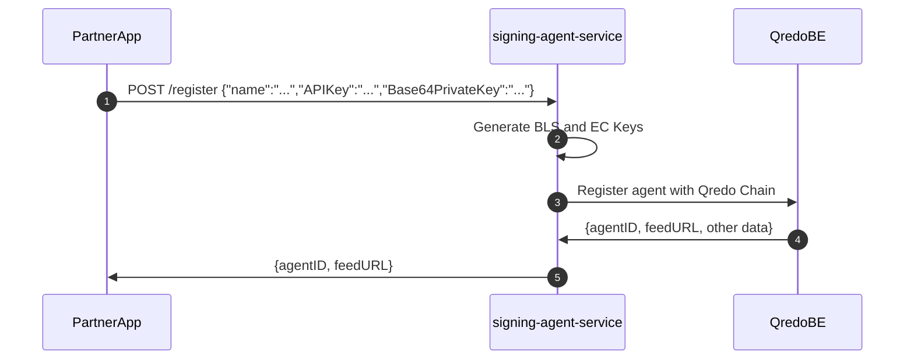
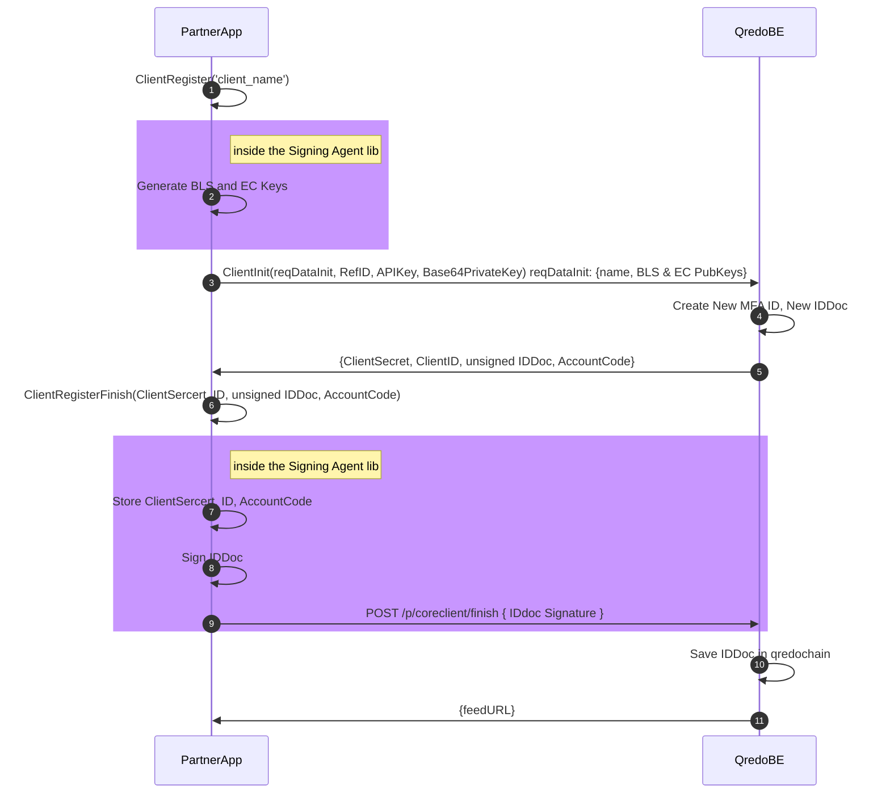
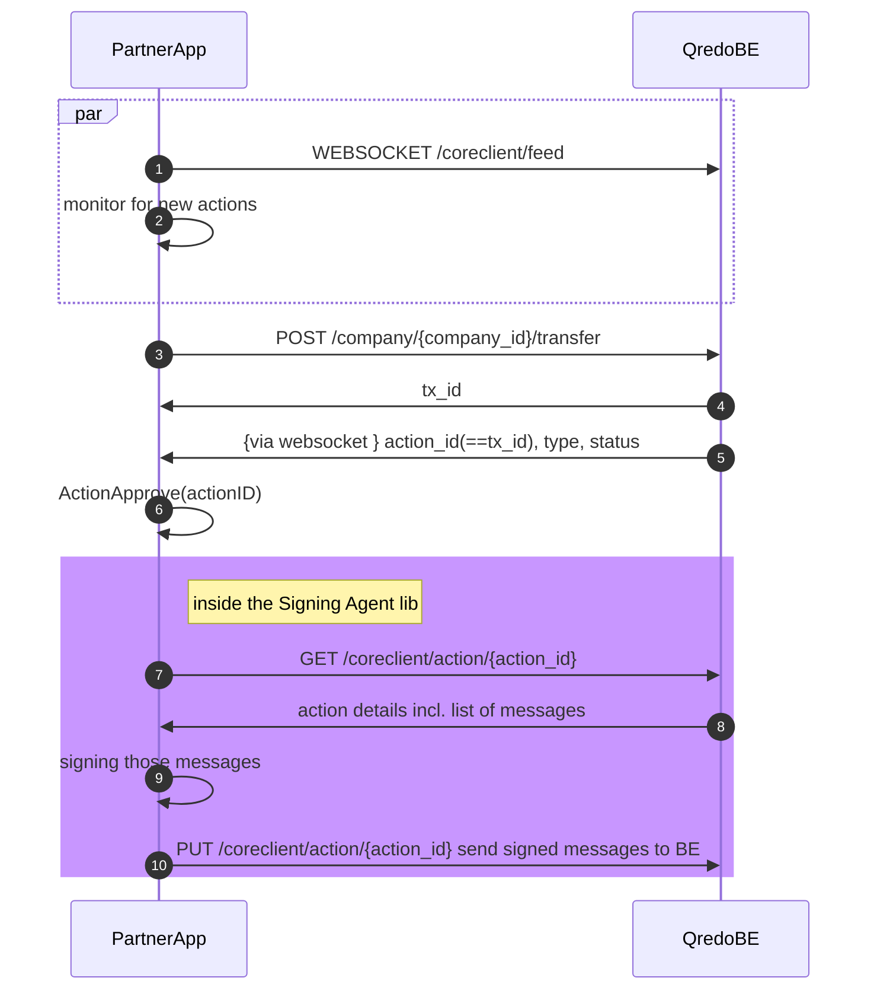

# Usage guide for the Signing Agent

[TOC]

## Introduction

The Signing Agent is an agent that can operate as a standalone service (exposing a RESTful API to 3rd party applications), or as a library integrated into an application. We recommend deploying the service on premise, on your own infrastructure. We also recommend that every Signing Agent instance be used to manage a unique agent ID, and that multiple instances be deployed (preferably on different cloud infrastructures) in order to meet a multiple signer threshold such as 2 or 3 out of 5. The Signing Agent uses a dedicated subset of the Qredo Server APIs, called the Partner API, to perform its functions. It can also be used to create a programmable approver service that listens to incoming approval requests over Websockets to perform automated custody.

In a nutshell, Signing Agent works just like the Qredo Mobile App but without the human element. The server acts just like a human approver, which means that it *approves* all transaction requests and [transactions that move assets out of a Qredo wallet](https://developers.qredo.com/concepts/transfers/).


## Cloud-based storage for secrets

An alternative to storing the Signing Agent configuration on-premises in a file is to use secure cloud-based storage. The following cloud-based solutions are supported.

### Oracle Cloud Vault Storage

In order to use Oracle Cloud Vault storage, update your configuration storage setting, i.e. set the `store` `type` to `oci` in the [YAML configuration file](https://developers.qredo.com/signing-agent/v2-signing-agent/configure/).

For example, your YAML config should look something like the following:

```yaml

store:
  oci:
    vault: ocid1.vault....
    secretEncryptionKey: ocid1.key....
    compartment: ocid1.tenancy....
    configSecret: signing_agent_config
  ...
```

- Set up an API key on Oracle Cloud
- Download the config file for the api key, fill in the correct private key path
- Either put the file in its default location of ~/.oci/config or
  put it in a custom location and set env var OCI_CONFIG_FILE to the full path including the filename
- Create a vault and copy the OCID to the config file for the vault setting
- Create an encryption key (AES or RSA) in the vault, copy it's OCID to the config secretEncryptionKey setting
- Copy the compartment OCID from the compartment where the vault was created
- Set a secret name where the Signing Agent will store its configuration and keys
- Start the Signing Agent and register an agent using the API

### AWS Cloud Secrets Manager Storage

In order to use AWS for configuration storage, update your configuration storage setting, i.e.  set the `storage_type` to `aws` and provide the AWS Region and the name of the Secrets Manager secret in the [YAML configuration file](https://developers.qredo.com/signing-agent/v2-signing-agent/configure/). 

For example, your YAML config should look something like the following:

```yaml
store:
  aws:
    region: eu-west-2
    configSecret: signingAgentConfig
  ...
```

The Secrets Manager secret (i.e. `signAgentConfig` in this example) needs to be set up in advance. To do this, on the AWS console:

1. Create a KMS customer-managed key to be used to encrypt the Secrets Manager secret
2. Create the Secrets Manager secret, naming it and including the KMS key from step 1
   - Select `Other type of secret`
   - Select `Plaintext` and enter `initialise me`
   - From the Encryption key drop-down, select the key created in step 1
   - Name the secret and optionally add a description
3. Update the Signing Agent's configuration file with the AWS region and secret name

Start the Signing Agent and register the agent using the API.

> Starting the Agent converts the secret's type from plaintext to binary.

**Note:** the Signing Agent needs access to AWS credentials in order to use AWS' Secrets Manager. How you do this is dependent on your requirements (for instance, the use of AWS access keys or an AWS credentials file, etc.) but, importantly, if running the Signing Agent in a Docker container, the AWS credentials need to be available to the Agent running in the container. This requires passing the AWS credential data to Docker at startup. As an example, AWS access keys can be passed as environment variables:
```shell
> docker run -e AWS_ACCESS_KEY=$AWS_ACCESS_KEY_ID -e AWS_SECRET_ACCESS_KEY=$AWS_SECRET_ACCESS_KEY ...
```
or, if using an AWS credential data contained in a local directory, something like this:
```shell
> docker run -v $HOME/.aws:/root/.aws ...
```
Specifics are best discussed with your cloud services admin department.

## Use Signing Agent as a Service

As mentioned above, the Signing Agent is a standalone component of the Qredo ecosystem. Everyone who intends to run an Signing Agent must first register it on the Qredo network. Below is a step-by-step explanation of the registration process, which involves the *PartnerApp* (i.e. your App), the *signing-agent-service* (e.g. Signing Agent running on your infrastructure), and *QredoBE* (e.g. our Qredo backend).



1. The *PartnerApp* triggers the registration process by providing its client name, parther APIKey and Base64PrivateKey  to the *signing-agent-service*.
2. *signing-agent-service* generates BLS and EC keys.
3. The *signing-agent-service* can now register itself to the partner API on the *QredoBE*, by sending the `client name`, `BLS`, and `EC` public keys. The *QredoBE* is returning ClientID, CLientSecret that will be responsible for authentication.
4. The `agentID` and a `feedURL` is returned by the *QredoBE* to the *signing-agent-service*. This feed is used by the *signing-agent-service* to keep a communication channel open with the *QredoBE*.
5. The `agentID` and a `feedURL` is also passed along to the *PartnerApp* so that the latter can monitor for new actions that need to be approved in case the service is not configured for auto-approval.

All the data above is currently stored on premises in a file by the signing-agent-service, and since some of it (ClientSecret, EC & BLS private keys) is quite sensitive it needs to be running in a secure environment.

> Up-to-date API documentation can be accessed within this [repo](https://github.com/qredo/signing-agent/blob/master/docs/swagger/swagger.yaml).

## API

### POST /api/v1/register

Request:

```json
{
  "name": "string",
  "APIKey": "string",
  "Base64PrivateKey": "string"
}
```

Response (AgentRegisterResponse):

```json
{
  "agentID": "string",
  "feedURL": "string"
}
```

## Use Signing Agent as a Library

There are times when the Signing Agent benefits from being tightly coupled with an application or a service. In this case, it can be imported as a Go package directly into that application.

 An example of the Signing Agent onboarding process using the Signing Agent library in a Go App would look like:



## Approve a transaction

Prerequisites:

- a Signing Agent service instance has been installed and configured
- a signing-agent has been created with id `agentID`

Steps:

1. A websocket connection to the *Qredo BE* is opened for said `agentID`
2. *PartnerApp* is constantly monitoring for new actions to be handled
3. A new transfer is initiated
4. The *Qredo BE* returns the transaction id: `tx_id`
5. Shortly after, a new action is received through the websocket with `action_id` equal to the `tx_id` for the transfer.
6. Initiate new action
7. The *PartnerApp* requests from the *Qredo BE* details for the action
8. *Qredo BE* returns action details incl. the payload (list of messages)
9. Sign payload (for the new action)
10. The *PartnerApp* decides to approve the transactions, thus sending the payload to the Signing Agent with a:

- `PUT` request for approve
- `DELETE` for reject

After that sequence, the transaction flow is complete.

## Use the library to approve a transaction



## Data Models

```Go
ClientRegisterFinishRequest {
    accountCode    string
    clientID   string
    clientSecret   string
    id  string
    idDoc  string
}
```

```Go
ClientRegisterRequest {
    name             string
    apikey           string
    base64privatekey string
}
```

```Go
SignRequest {
    message_hash_hex    string
}
```

```Go
VerifyRequest {
    message_hash_hex    string
    signature_hex   string
    signer_id   string
}
```

```Go
clientRegisterFinishResponse {
    feed_url    string
}
```

```Go
clientRegisterResponse {
    bls_public_key  string
    ec_public_key   string
    ref_id  string
}
```

```Go
signResponse {
    signature_hex   string
    signer_id   string
}
```
